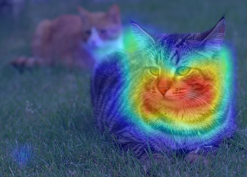
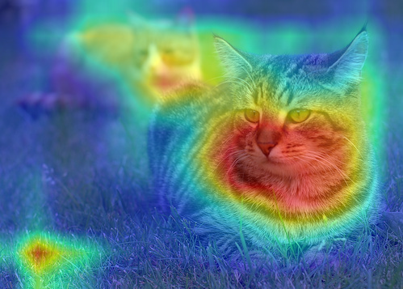
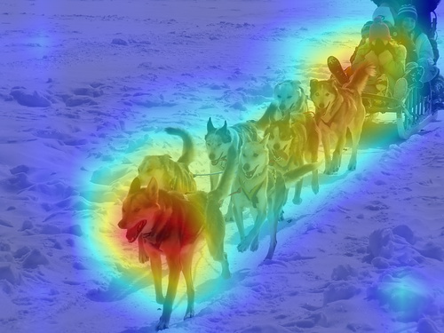

# Score CAM with pytorch
The re-implementation of Smooth Grad-CAM++ with pytorch.
This repo also includes the code of CAM, Grad-CAM, Grad-CAM++, Smooth Grad-CAM++.

## Requirements
* python 3.x
* pytorch >= 0.4
* pillow
* numpy
* opencv
* matplotlib

## How to use
You can use the CAM, GradCAM, GradCAM++, Smooth Grad-CAM++ and Score CAM as a model wrapper described in `cam.py`.
Please see `demo.ipynb` for the detail.

# Results
|image|||
|:-:|:-:|:-:|
|CAM|||
|Grad-CAM|||
|Grad-CAM++|||
|Smooth Grad-CAM++|||
|Score CAM|||

## References
* Score-CAM: Improved Visual Explanations Via Score-Weighted Class Activation Mapping,
  Haofan Wang, Mengnan Du, Fan Yang, Zijian Zhang [[paper](https://arxiv.org/abs/1910.01279)]
* Smooth Grad-CAM++: An Enhanced Inference Level Visualization Technique for Deep Convolutional Neural Network Models,  
  Daniel Omeiza, Skyler Speakman, Celia Cintas, Komminist Weldermariam [[paper](https://arxiv.org/abs/1908.01224)]
* Learning Deep Features for Discriminative Localization, 
  Bolei Zhou, Aditya Khosla, Agata Lapedriza, Aude Oliva, Antonio Torralba [[paper](http://cnnlocalization.csail.mit.edu/Zhou_Learning_Deep_Features_CVPR_2016_paper.pdf)]
* Grad-CAM: Visual explanations from deep networks via gradient-based localization,
  Ramprasaath R. Selvaraju, Michael Cogswell, Abhishek Das, Ramakrishna Vedantam, Devi Parikh, Dhruv Batra, [[paper](https://arxiv.org/abs/1610.02391)]
* Grad-CAM++: Improved Visual Explanations for Deep Convolutional Networks,
  Aditya Chattopadhyay, Anirban Sarkar, Prantik Howlader and Vineeth N Balasubramanian[[paper](https://arxiv.org/pdf/1710.11063.pdf)]
